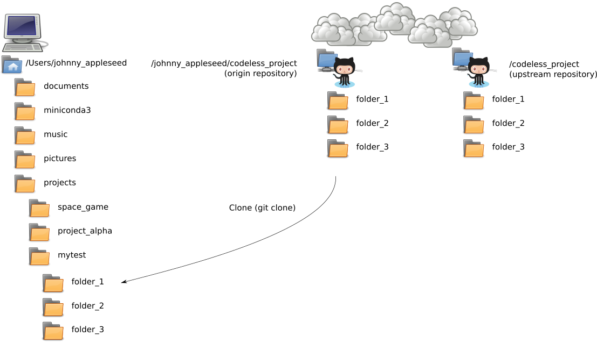

<!-- begin auto-generated title section -->
# Cloning a Repository
<!-- end auto-generated section -->


## Time-box

12 Minutes


## Overview

With a fork of the project in your GitHub repository, it's time to `git clone` the project to your local computer, so you have a local copy on your machine to do work on. The project we will start with is a project that doesn't have any code in it. It is a project full of famous poems. This is on purpose. We want to start off by

* practicing **the mechanics** of making changes and propogating those changes to the owner
WHILE
* **minimizing the fear** of breaking anything AND
* **avoiding** having to figure out the nuances of someone else's code

## What to do

**Create a `mytest` folder**

Find a folder where you can create a place to store your project files for today. Make it easy to get to! = ) 

Then change directories to be in the folder...

```bash
$ mkdir mytest
$ cd mytest
```

### Cloning

Use the `git clone` command to clone a copy of the repository to the `mytest` directory.

**Note:** Since you are not Johnny Appleseed, **ENSURE** that you change `johnny_appleseed` to the name of **YOUR** account.

```bash
$ git clone https://github.com/johnny_appleseed/intro_to_sprinting_codeless_project.git
```

### Move into the new cloned repository

The `clone` command will create a new folder in the `mytest` directory. Change directories into the new folder, using the following command:

```bash
$ cd intro_to_sprinting_codeless_project
```
Next, add a reference to the **original repo (i.e. Chalmer's repo)** using the `git remote` command. The reference is often referred to as an `upstream`:

```bash
$ git remote add upstream https://github.com/chalmerlowe/intro_to_sprinting_codeless_project.git
```

**Note:** You'll only do this **one time for each project** you want to work on.


## The big picture

Before you can start adding to a project, you will need to clone the project to your local computer in your local working directory. In this picture, presume we are wanting to work on a the RPN Calculator Project. It has been forked to our GitHub repo and then cloned to our local hard drive. Copies of all the folders in the RPN Calculator are now available on our local computer.




## Deep dive

The following discussion will give you more insight into cloning repositories and what happens in the background during each of these commands.

**Note:** Since you are not Johnny Appleseed, **ENSURE** that you change `johnny_appleseed` to the name of **YOUR** account.

```bash
$ git clone https://github.com/johnny_appleseed/intro_to_sprinting_codeless_project.git
```

The `clone` command creates a folder, which should be full of project files. `git` will automatically set up a link to a repository and will give it the default name: `origin` as a **remote** repository. In this case, it will point to **your** GitHub fork of the repository.

If you are curious, and want to confirm the link and the name of the remote repository, you can use the `git remote -v` command:

```bash
$ git remote -v
origin  https://github.com/johnny_appleseed/intro_to_sprinting_codeless_project (fetch)
origin  https://github.com/johnny_appleseed/intro_to_sprinting_codeless_project (push)
```
Here we see that for the `origin` remote repository, we have the ability to fetch data from it and push data to it. This ability to push data to the repository makes sense, since we own that repository.

As part of committing to open source projects, we want to get updates from the original repository (often called the `upstream` repository) whenever the project developer makes changes so that we can confirm that nothing we have done will interfere with any other work being done on the project.

To enable `git` to find the `upstream` we use the following command:

```bash
$ git remote add upstream https://github.com/chalmerlowe/intro_to_sprinting_codeless_project.git
```

Again, if you are curious, you can confirm that `git` has stored the correct upstream repository with the command `git remote -v`. And now we see that `git` recognizes both our GitHub repo and the original project's repo.

```bash
$ git remote -v
origin   https://github.com/johnny_appleseed/intro_to_sprinting_codeless_project (fetch)
origin   https://github.com/johnny_appleseed/intro_to_sprinting_codeless_project (push)
upstream https://github.com/chalmerlowe/intro_to_sprinting_codeless_project (fetch)
```

**Note:** You'll only do this **one time for each project** you want to work on.


## Resources

* [Git Basics - Getting a Git Repository](https://git-scm.com/book/en/v2/Git-Basics-Getting-a-Git-Repository)

<!-- begin auto-generated nav-links section -->
| Previous | Up | Next |
|:---------|:---:|-----:|
| [Git Concepts](./git_concepts.md) | [Using Git](./git_overview.md) | [Git Primary Workflow: Add, Commit, Push](./git_main_lifecycle.md) |
<!-- end auto-generated section -->
