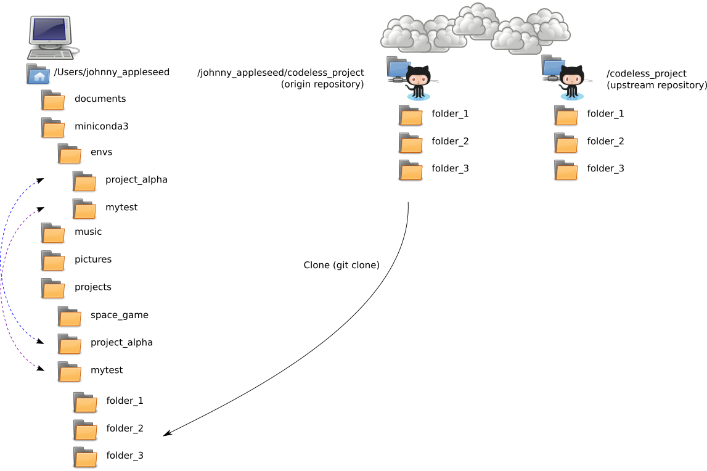

# Cloning a Repository


## Time-box

<XX> Minutes


## Overview

With a copy of the project in your Github repository, it's time to clone the project to your local computer, so you have a local copy on your machine to do work on.


## What to do

Make sure you are in your project directory `mytest`, if you are not there already.

```bash
$ cd /path/to/my/dev/directory/mytest
```

Use the `git clone` command to clone a copy of the repository to the `mytest` directory.

**Note:** *ENSURE* that you change `<your_username>` to the name of *YOUR* account.

```bash
$ git clone https://github.com/<your_username>/intro_to_sprinting_codeless_project.git
```

The `clone` command will create a new folder in the `mytest` directory. Change directories into the new folder, using the following command:

```bash
$ cd intro_to_sprinting_codeless_project
```
Add a reference to the **original repo (Chalmer's repo)** using the `git remote` command:

```bash
$ git remote add upstream https://github.com/chalmerlowe/intro_to_sprinting_codeless_project.git
```

**Note:** You'll only do this **one time for each project** you want to work on.


## The big picture

Before you can start adding to a project, you will need to clone the project to your local computer in your local working directory. In this picture, presume we are wanting to work on a the RPN Calculator Project. It has been forked to our Github repo and then cloned to our local hard drive. Copies of all the folders in the RPN Calculator are now available on our local computer.




## Deep dive

The following discussion will give you more insight into cloning repositories and what happens in the background during each of these commands.

Enter the following command on the command line, **ENSURE that you change `<your_username>`** to the name of your account:

```bash
$ git clone https://github.com/<your_username>/intro_to_sprinting_codeless_project.git
```

The `clone` command creates a folder, which should be full of project files. Git will automatically set up a link to a repository and will give it the default name: `origin` as a **remote** repository. In this case, it will point to **your** Github fork of the repository.

If you are curious, and want to confirm the link and the name of the remote repository, you can use the `git remote` command:

```bash
$ git remote -v
origin  https://github.com/myusername/intro_to_sprinting_codeless_project (fetch)
origin  https://github.com/myusername/intro_to_sprinting_codeless_project (push)
```
Here we see that for the `origin` remote repository, we have the ability to fetch data from it and push data to it. This ability to push data to the repository makes sense, since we own that repository.

As part of committing to open source projects, we want to get updates from the original repository (often called an `upstream` repository) whenever the project developer makes changes so that we can confirm that nothing we have done will interfere with any other work being done on the project. 

To enable git to find the `upstream` we use the following command:

```bash
$ git remote add upstream https://github.com/chalmerlowe/intro_to_sprinting_codeless_project.git
```

Again, if you are curious, you can confirm that git has stored the correct upstream repository with this command `git remote`. And now we see that git recognizes both our Github repo and the original project's repo.

```bash
$ git remote -v
origin   https://github.com/myusername/intro_to_sprinting_codeless_project (fetch)
origin   https://github.com/myusername/intro_to_sprinting_codeless_project (push)
upstream https://github.com/chalmerlowe/intro_to_sprinting_codeless_project (fetch)
```

**Note:** You'll only do this **one time for each project** you want to work on.


## Resources

* [<resource name>](<resource url>)
* [<resource name>](<resource url>)


| Previous | Up | Next |
|:---------|:---:|-----:|
| [Git Concepts](./git_concepts.md) | [Using Git](./git_overview.md) | [Git Primary Workflow: Add, Commit, Push](./git_main_lifecycle.md) |
