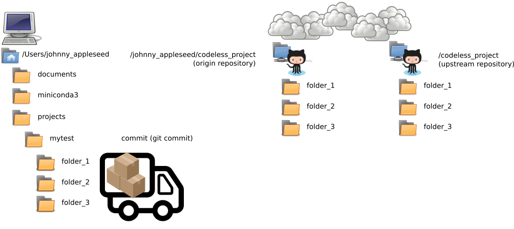
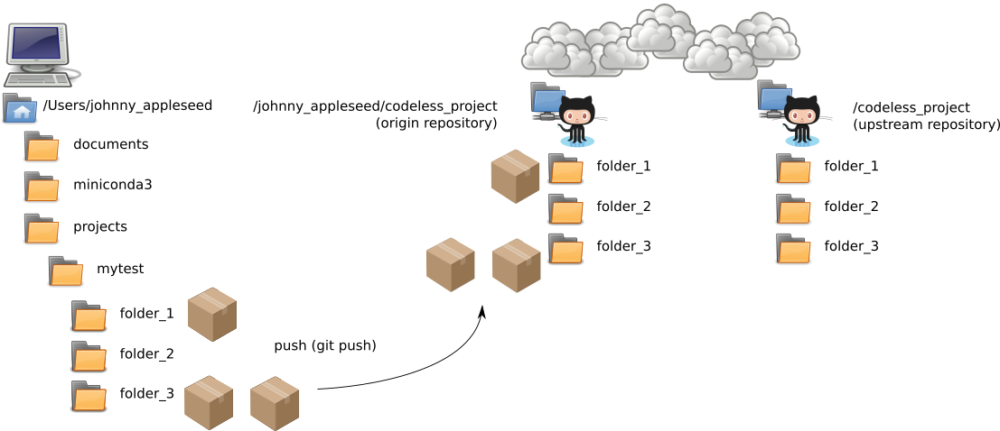

# Git Concepts

## Time-box

<XX> Minutes

## Overview

<put single paragraph here>

## What to do

<steps to execute go here, no details, just raw steps>

## The big picture

[Jessica Kerr](https://github.com/jessitron) gave a great talk using this analogy, you can watch it here:

## Deep dive

<detailed explanations go here, with h3/h4 subsecitons if necessary>

## Resources

* [<resource name>](<resource url>)
* [<resource name>](<resource url>)

| Previous | Up | Next |
|:---------|:---:|-----:|
| [Using Git](./git_overview.md) | [Using Git](./git_overview.md) | [Cloning a Repository](./git_cloning.md) |

Git repositories are very sophisticated, but at the lowest level, they are fairly simple. Git tracks changes to files in a database AND categorizes files in the following ways:

1. Local directory (warehouse)
2. Staging area (pallet)
3. Commit (truck)
4. Remote (remote warehouse shared by all, typically called "origin")

As we look at each of these, we will imagine that we are processing materials in a warehouse and shipping them to another location.

### Local directory

The **local directory** is simply the directory on your machine and it contains all your files, drafts, completed work, incomplete work, tools, etc. This material is uniquely yours. We can consider this to be the warehouse in our example. There are plenty of materials: some that are necessary to run the warehouse (but not part of what is typically stored in the warehouse), some things that have been ordered, and some things that are not quite ready to ship. Any new files you create in your local directory will only be visible to you.

### Staging area

The **staging area** holds all the files that are ready to added to the project and shared with others. The staging area can be compared to the pallet in our example. Everything that is 'done' and ready to be loaded on the truck gets placed on the pallet. To put a file into the staging area (i.e. add  it to the pallet), you will use the `git add` command (described below). Just like a pallet, you can continue to add files to the staging area, essentially indefinitely. While things are still in the staging area (on the pallet), it is fairly easy to add more files, remove files, change files, etc.

**NOTE**: if you add a file to the staging area and **THEN** make additional changes to the file, you will need to add the file a second time to capture the newest changes.

### Commit

The **commit area** holds all the changes that you are going to release to the internet, and ultimately to original author. The commit area can be compared to the truck in our example. Once your pallet is full, you load it onto the truck for delivery. Everything that is ready to be shipped goes into the commit area (gets loaded on the truck). To commit a file, you will use the `git commit` command (described below).

**NOTE**: much like we saw above...if you edit something that has been committed, then the new changes will not be released to the original author. Any new changes will have to be added to the staging area and then committed.

### Remote

A **remote** is some other repository other than the local copy on your computer; this is typically stored somewhere like GitHub but can be just about anywhere. Remotes are named, and the default name for the first remote is **origin**. Another remote name you will hear often if you're submitting code to other people's projects is **upstream**, which usually refers to the original project you forked from.

Nothing gets copied from your local system until you `git push` it to a remote repository. Only items that have been committed are pushed to a remote. Pushing to `origin` (the default remote when you clone from GitHub, for example) can be compared to the truck driving away to deliver the pallet. Once changes have been pushed, they are published and others can see those changes in your Github repository. 

**NOTE:** we're not yet thinking about how to get your changes back to the original project; that will be covered later.

## Documentation and Books:

[Pro-Git](https://git-scm.com/book/en/v2), a free online resource (and in [PDF](https://progit2.s3.amazonaws.com/en/2016-03-22-f3531/progit-en.1084.pdf) form to save to your computer) with comprehensive documentation about using git well by Scott Chacon and Ben Straub

[User Manual](https://git-scm.com/docs/user-manual.html)

## Tutorials and videos:

[Interactive Tutorial](https://try.github.io/levels/1/challenges/1)

[A Successful Git Branching Model](http://nvie.com/posts/a-successful-git-branching-model/), which describes the branching model used by a variety of large and small projects; some projects do this differently, but the basic ideas are common with all of them

[Written Tutorial](https://git-scm.com/docs/gittutorial)

[Git Happens](https://youtu.be/yCh6TSLIQBQ) video by Jessitron (Jessica Kerr) that uses the warehouse analogy to help clarify directory, staging, commit

[Video collection](https://git-scm.com/videos)

[50/72 rule for git commit messages](http://stackoverflow.com/questions/2290016/git-commit-messages-50-72-formatting) How to format git commit messages efficiently

## Reference Manuals:

[Official Reference Manual](https://git-scm.com/docs)

[Git cheatsheet](https://education.github.com/git-cheat-sheet-education.pdf)
