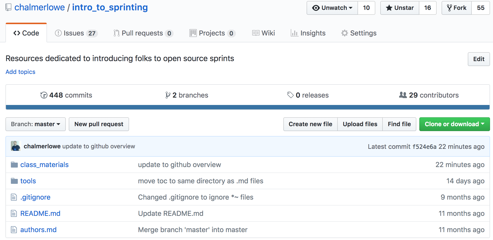

<!-- begin auto-generated title section -->
# GitHub Concepts
<!-- end auto-generated section -->

## Time-box

10 Minutes

## Overview

GitHub is a powerful platform. There are many features and capabilities available in GitHub. Let's review a handful of them.

## What to do

1. Navigate to **your GitHub** repo for the Codeless Project. **NOTE:** make sure you are looking at **your repo**.
1. Your repo has a number of tabs across the top: `Code`, `Issues`, `Pull requests`, `Projects`, `Wiki`, `Insights`, etc.

1. Click on the `Issues` tab. You will find a list of issues.  

1. Click on several issues and explore them: see whether they have milestones, what labels they might have, what discussion is occurring relative to that issue, etc.
1. Click on the `Wiki` tab. This is a great place to capture documentation and planning notes.

**NEXT** Navigate to the **upstream GitHub repo** for the Codeless Project. I often do this by clicking the small link under the name of the repo AND opening the link in a new tab so that I have both my **origin GitHub repo** and the **upstream GitHub repo** open at the same time. That link should say something like: `'forked from chalmerlowe/intro_to_sprinting_codeless_project:'` much like this example from `sigsevneo`'s repository. 

Once you get to the upstream GitHub repo, look at each of the items above, but see how the **upstream repo** might differ from and is similar to **your repo**.

* are the tabs different?
* do you have the ability to perform certain actions as the owner of your repo versus being a visitor to someone else's repo?
* etc.

If you (and your partner, if you're working in pairs) are done, then you can put your green sticky up! This is how we know you're done.

## The big picture

The tools seen above are intended to help improve the ability of team members to communicate and track changes and proposed changes to projects.

* If you find a problem in your repo you want help with OR you want to track, you may publish an Issue to let your colleagues know how they can help.
* If you find a problem in an open source project that you feel needs correcting, but you don't have time or expertise, you may submit an Issue on the upstream project repo.

For this Intro to Sprinting workshop, if you have suggestions that would improve the learning experience, we urge you to either:

* submit an Issues

OR better yet

* write up a possible edit > `git add` > `git commit` > `git push` and then move on to the next lesson and submit a Pull Request so we can consider your idea and maybe even incorporate it into the lesson material!

## Deep dive

N/A

## Resources

* [GitHub - Contributing to a Project](https://git-scm.com/book/en/v2/GitHub-Contributing-to-a-Project)

<!-- begin auto-generated nav-links section -->
| Previous | Up | Next |
|:---------|:---:|-----:|
| [Using GitHub](./github_overview.md) | [Using GitHub](./github_overview.md) | [Submitting a Pull Request](./github_submit_pull_request.md) |
<!-- end auto-generated section -->
