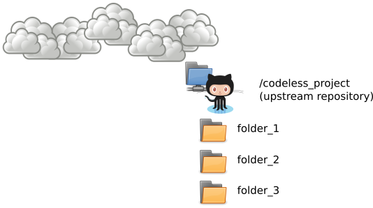

# Setting up GitHub

## Time-box

<XX> Minutes

## Overview

GitHub is a web-based version control repository. It also serves as an Internet hosting service. Github provides the functionality of `Git` (like distributed version control and source code management). It also offers bug tracking, task management, wikis, gists, feature requests and more. Github is the world's largest repository for source code. Github is used in tandem with `Git` to make changes, share changes, deal with conflicts and enable project participants to synchronize their work.

## Objectives

Through participating in this session, attendees will be able to:

* Understand why GitHub is used in an open source project
* Use some basic features of GitHub to contribute to a project, including creating a copy of the project

A later session will show additional steps in the process such as issuing a **pull request**, etc.

## What to do

If you **ALREADY** have a Github account, log into your regular account.

If you **DO NOT** have a Github account, you will need to make one:

1. Open your browser and navigate to the [GitHub Home Page](https://github.com/)
2. Fill out the form on the home page:
   * Pick a username (you will need a unique username)
   * Enter your email address
   * Create a password   
3. Click "Sign up for GitHub"

Fork the [Codeless Project](https://github.com/chalmerlowe/intro_to_sprinting_codeless_project/) into your GitHub acccount:

1. In the upper right hand corner, you'll see a **Fork** button: 

2. Click the Fork button to to create a fork under your account

**NOTE**:  As mentioned, the fork refers back to the original repo - if you look under your repo name, you'll see it's "forked from chalmerlowe/intro\_to\_sprinting\_codeless\_project:" 

## The big picture

Projects files on Github are often called repositories or **repo/repos** for short. For every project you contribute to, you will interact with two different repos:

* One repo will be the original project repository
* The other repo will be your personal copy of the original repo

When you want to work on a project, Github will enable you to **fork** the project so that you can have a copy of the project under your account.

## Deep dive

### Forking a repository

A **fork** of a repository is a copy, hosted under your account, of a repository created by someone else. You then have complete control to modify and change the code to suit your needs (within the limits of copyright/the license on the project). The fork is tied to the original repository (repo) and you can issue requests to the original owner to incorporate your changes into the original project. This process is called a **pull request**.

[TODO: more discussion of forks]

## Resources

* [GitHub Bootcamp](https://help.github.com/categories/bootcamp/)
* [GitHub Help](https://help.github.com/)
* [Are git forks actually git clones?](http://stackoverflow.com/questions/6286571/are-git-forks-actually-git-clones)

| Previous | Up | Next |
|:---------|:---:|-----:|
| [Setting up Virtual Environments](./virtual_environments.md) | [Environment Set-up](./environment_overview.md) | [Forking a Repository](./fork_a_repo.md) |
