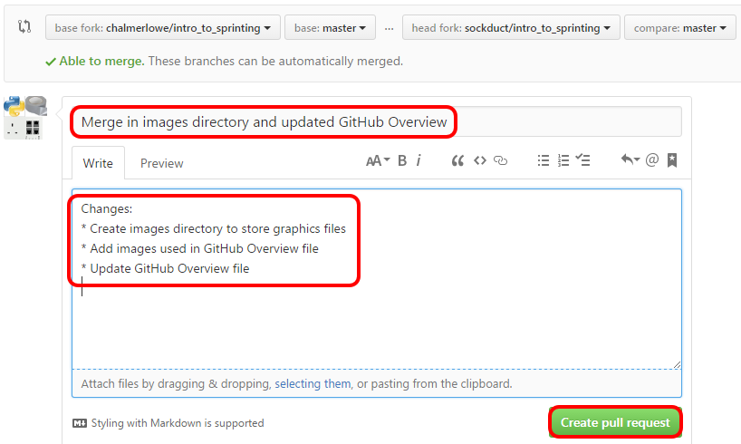

# Using GitHub

GitHub is a web-based version control repository. It also serves as an Internet hosting service. Github provides the functionality of Git (like distributed version control and source code management). It also offers bug tracking, task management, wikis, gists, feature requests and more. Github is the world's largest repository for source code. Github is used in tandem with Git to make changes, share changes, deal with conflicts and enable project participants to synchronize their work.

# Objectives
Through participating in this session, attendees will be able to:

* Understand why GitHub is used in an open source project
* Use some basic features of GitHub to contribute to a project, including:
  * Creating your own copy of the project
  * Issuing requests to the owners of the project to incorporate changes you suggest

# Lecture/Demos

## How do you get started?

### Create OR login to a GitHub account

If you **DO NOT** have a Github account, you will need to make one:

1. Open your browser and navigate to [The GitHub Home Page](https://github.com/)
2. Fill out the form on the home page:
   * Pick a username (you will need a unique username)
   * Enter your email address
   * Create a password   
3. Click "Sign up for GitHub"

If you **ALREADY** have a Github account, log into your regular account.

## Fork a repository

A **fork** of a repository is a copy, hosted under your account, of a repository created by someone else. You then have complete control to modify and change the code to suit your needs (within the limits of copyright/the license on the project). The fork is tied to the original repository (repo) and you can issue requests to the original owner to incorporate your changes into the original project. This process is called a **pull request**.

To practice these steps, we will have you fork these instructions to your local machine. Navigate to Chalmer Lowe's Introduction to Sprinting repo @ [https://github.com/chalmerlowe/intro_to_sprinting/](https://github.com/chalmerlowe/intro_to_sprinting/).

1. In the upper right hand corner, you'll see a **Fork** button: 

2. Click the Fork button to to create a fork under your account
3. **NOTE**:  As mentioned, the fork refers back to the original repo - if you look under your repo name, you'll see it's "forked from chalmerlowe/intro_to_sprinting:"

4. The next step will be to clone the repo from your online Github account to your local computer. That step will be covered in depth in the next lesson: [Git Overview](./lesson_05_git_overview.md)

In the interim, since we are here looking at Github, let's figure out how to make a Pull Request.

## Submit a Pull Request

**NOTE**: the following steps are to be used **AFTER** you have made changes to the project and are ready to share those changes with the original project author. 

**NOTE**: We are presuming that your changes have **already** been pushed to your OWN Github repo (instructions on how to do this are covered in the next lesson: [Git Overview](./lesson_05_git_overview.md). 

Once your changes have been pushed to your own Github repo, you will need to submit a Pull Request.
 
1. Above the file list on the left hand side, click on "New Pull Request:"

2. Github will allow you to confirm which changes in your repo you want to share with the original author, as shown in the following image. **NOTE**: Github transfers you to the repo of the original author, so you will no longer be on your Github account page. 
3. Before proceeding, you should check for the following items.
  * Confirm that the **base fork** is your fork
  * Confirm that the **head fork** is the original author's fork
  * Confirm that Github says: **Able to merge** (IF there are conflicts, refer to the [Git Overview](./lesson_05_git_overview.md) for instructions on how to fix this problem.

4. Click on "**Create pull request**"
5. Follow these steps to prep the Pull Request for creation:
    * Write a Summary Title describing your changes
    * Write a brief Description of what you're changing in this pull request
    * Click on "**Create pull request**"

* **REMINDER**:  This leaves you in the original author's repo (Chalmer Lowe in this case) and not your own! 

# Hands-on

For the hands-on portion of the Calculator project, you will need to fork the calculator repo.

1. Navigate to this github repo: [RPN Calculator](https://github.com/chalmerlowe/rpn_project_20170311)
2. Fork the repo to your github account as described in the instructions above.
3. The next step: Cloning the repo to your local computer, will be covered in the next lesson [Git Overview](./lesson_05_git_overview.md).

Once you have made changes to your local code:
        
1. Push those changes back up to your github account (Details on how to do this will be covered in the next lesson: [Git Overview](./lesson_05_git_overview.md))
2. Return to your github account and issue a pull request, as described in the instructions above.

# Resources

Curious about the difference between a Fork and a Clone? See the StackOverflow discussion of: ["Are git forks actually git clones?"](http://stackoverflow.com/questions/6286571/are-git-forks-actually-git-clones)

|[<<< Previous Lesson: Virtual Environments](./lesson_03_venv_overview.md)|[Next Lesson: Git Overview >>>](./lesson_05_git_overview.md)|
|:--|--:|