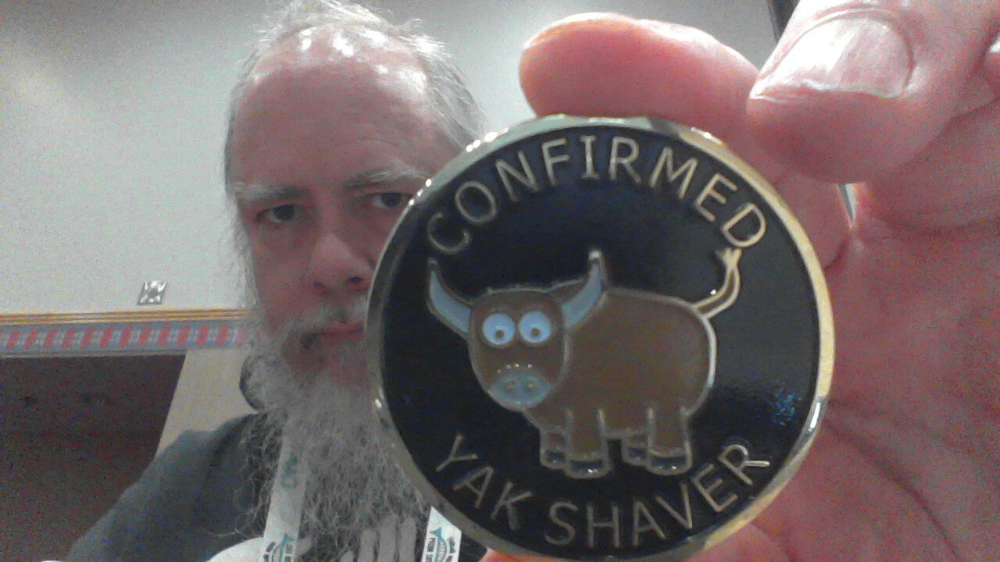

<!-- begin auto-generated title section -->
# Course Overview and Preparation
<!-- end auto-generated section -->

## Overview

Welcome to the **Introduction to Open Source Workshop**. Participants are expected to walk away with enough knowledge to be able to participate in a typical open source project. The workshop has a mixture of hands-on exercises and lecture/demos, with the focus on hands-on activities.

### What to expect

This workshop covers...

* [Installing software](./installing_tools.md): basic installation of the version control software Git
* [Using Git](./git_overview.md): basic commands to copy a repository, add your changes, commit those changes and push the changes to Github
* [Using GitHub](./github_overview.md): basic overview of the collaborative tools on GitHub and how to issue a pull request
* [Practicing your skills](./for_realz.md): A chance to practice these skills on a project on GitHub

If you have time to move beyond Git, this workshop also covers:

* [Working with Real Projects](./projects_with_code.md): Installing software and creating a working environment for a few real-world scenarios

### What not to expect

This workshop does **not** cover...

* How to program
* Programming in any specific language

This is not a programming workshop, nor is it a Python workshop. It is intended to prep students to contribute to open source projects; it is not intended to teach students how to program.

## Learning objectives

Participants should expect to achieve the following learning objectives upon completing this workshop:

* Be able to install the following software: `conda`, `git`, etc
* Be able to use `git` and GitHub to create a copy of an open source project on their own computer
* Upon editing, adding, or deleting content in a project:
  * incorporate any changes to the project, made by others, into their own local copy
  * correct any conflicts between their changes and others' changes
  * successfully issue a request for their contribution to be added to the open source project
* Be able to create a virtual environment (if working in Python)

Ultimately, the goal is to help you overcome some of the hurdles inherent in successfully contributing to an open source project...

## Testimony/Feedback...

Here is some feedback from a previous attendee at one of our workshops:

> "...after nearly 60 years, an Open Hatch workshop, and two PyCon "How to Sprint" workshops, I think I'm beginning to get the hang of things. ;-)

> I'm a BeeWare developer.​​ I have a new job title: Confirmed Yak Shaver. And I have the coin of the realm to prove it. ;-)"

> **Kevin Cole**

## Preparatory Lessons

Depending on your role (instructor vs student) and/or level of experience, the following preparatory lessons should be useful in getting you ready to successfully completing this workshop.

* [Instructor Preparation](./prereq_instructor.md): Steps the instructor should take to prepare for the workshop
* [Student Preparation](./prereq_student.md): Steps the students should take to prepare for the workshop

<!-- begin auto-generated nav-links section -->
| Previous | Up | Next |
|:---------|:---:|-----:|
| [Table of Contents](./README.md) | [Table of Contents](./README.md) | [Instructor Preparation](./prereq_instructor.md)  OR   [Student Preparation](./prereq_student.md)|
<!-- end auto-generated section -->
